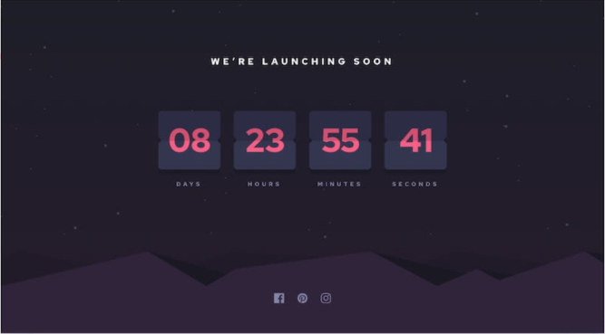

# Launch Countdown Timer
This is a solution to the [Launch Countdown Timer](https://www.frontendmentor.io/challenges/launch-countdown-timer-N0XkGfyz-). Frontend Mentor challenges help you improve your coding skills by building realistic projects.
## Table of contents
- [Launch Countdown Timer](#launch-countdown-timer)
  - [Table of contents](#table-of-contents)
  - [Overview](#overview)
    - [The challenge](#the-challenge)
    - [Clone this repository](#clone-this-repository)
  - [Built with](#built-with)
  - [Author](#author)
## Overview


### The challenge

Users should be able to:

- See hover states for all interactive elements on the page
- See a live countdown timer that ticks down every second
- *Bonus*: When a number changes, make the card flip from the middle


### Clone this repository
```bash
# Clone this repository
$ git clone https://github.com/TKadyear/launch-countdown-timer.git

# Go into the repository
$ cd launch-countdown-timer

# Install dependencies
$ npm install

# Run the local server
$ npm run dev
```

If you want the production server do:
```bash
#For prepare the documents for production:
$ npm run build

#Run the preview of production server

$ npm run preview
```

## Built with

- Semantic HTML5 markup
- CSS custom properties
- Flexbox
- Vue.js


## Author
- Github - [Tamara Kadyear | TKadyear](https://github.com/TKadyear)
- Frontend Mentor - [Tamara Kadyearr | TKadyear](https://www.frontendmentor.io/profile/TKadyear)
